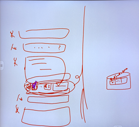
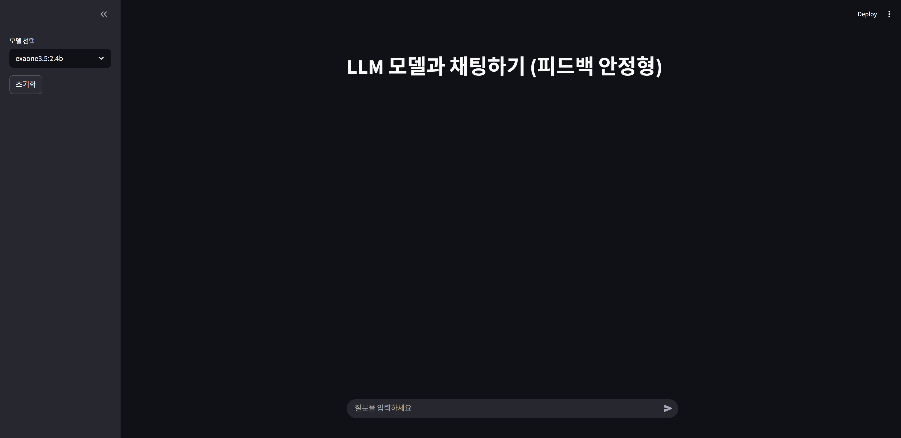
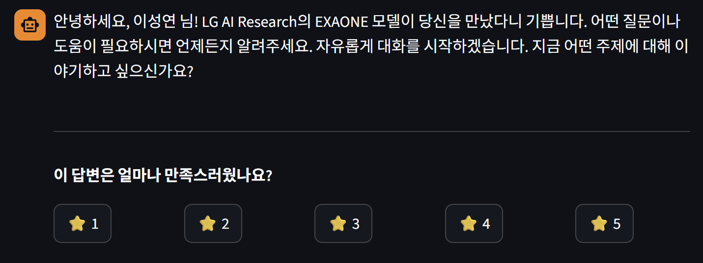
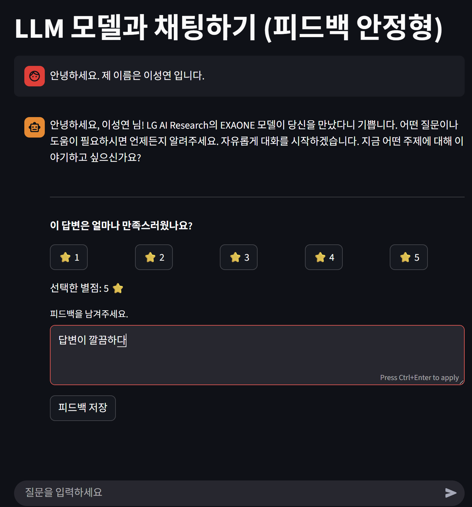
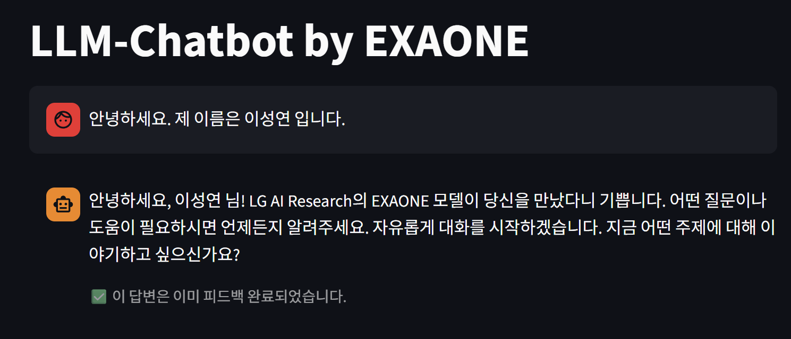

# 2025 라이즈 프로젝트-1

# 주제: streamlit을 이용하여 chatbot대화 서비스 제작
#### https://bigoutput.tistory.com/106 
#### 해당 블로그를 참고 하여 제작 하였습니다.

# 구현 하고자 하는 목표

1. streamlit 내에서 정상작동되는 chatbot
2. 사용자와 챗봇의 대화가 분리되는 UI
3. 챗봇의 대화에 대해서 피드백 받는 기능 구현(별점, 문장)
4. 피드백을 데이터베이스를 통하여 관리

UI 예시

streamlit 실행전 환경 설정

1. 아나콘다 설치(https://www.anaconda.com/download)
2. conda 가상환경 생성(conda create -n Rstream python=3.10)
3. https://github.com/seongkai102/2025_Rise_Project/tree/main/First_report을 방문하여 폴더 다운받기
- git clone https://github.com/seongkai102/2025_Rise_Project.git
4. 아래 명령어를 통해 라이브러리 설치 
- pip install -r "requirements.txt"
- 오류시 requirements.txt의 절대 경로 입력
5. ollma 다운받기(https://ollama.com/download/windows)
6. ollma 설치가 끝났다면 CMD실행후 - ollama pull exaone3.5:2.4b 입력

이로써 환경은 전부 설정 되었다.

vsc를 실행 시킨후 streamlit run app.py를 하면

위와 같은 화면이 나오고

메세지를 입력하면 출력과 함께 별점 입력 버튼이 출력된다.

버튼을 클릭하면 피드백 입력칸이 나오게 된다.

피드백을 입력하면 상태가 변경이 되고 CSV에 저장이 된다

<table border="1" class="dataframe">
  <thead>
    <tr style="text-align: right;">
      <th></th>
      <th>질문</th>
      <th>별점</th>
      <th>피드백</th>
      <th>인공지능 답변</th>
    </tr>
  </thead>
  <tbody>
    <tr>
      <th>0</th>
      <td>안녕하세요. 제 이름은 이성연 입니다.</td>
      <td>5</td>
      <td>답변이 깔끔하다</td>
      <td>안녕하세요, 이성연 님! LG AI Research의 EXAONE 모델이 당신을 만...</td>
    </tr>
  </tbody>
</table>

